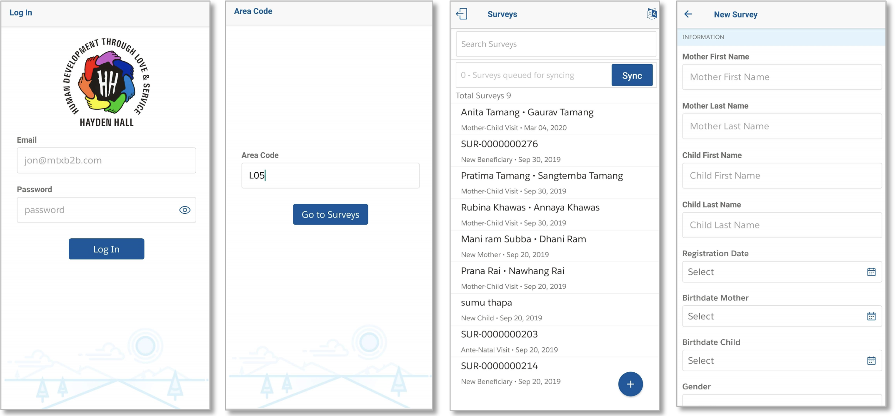

# Hayden Hall Mobile App
[](https://github.com/hayden-hall/mobile-app/actions?query=workflow%3A%22unit%20test%22) [](https://codecov.io/gh/hayden-hall/mobile-app)

<p align="center">

</p>



## About This Project
See [the wiki page](https://github.com/hayden-hall/mobile-app/wiki/About)

## Development
1. Clone the repository.
2. Run `npm install` to install dependency.
3. Install expo app ( [Android](https://play.google.com/store/apps/details?id=host.exp.exponent) | [iOS](https://apps.apple.com/jp/app/expo-client/id982107779) ) in your mobile device.
4. Run `npm start`. Metro bundler will open as new browser tab. Scan the QR Code and test the app in your device.

### Environment Variable
Create a `.env` file to set the endpoint URL of the [Login API](https://github.com/hayden-hall/auth0-salesforce-login-api)

```
LOGIN_API_URL=https://YOUR_HEROKU_APP.herokuapp.com/login
```

## Build
```
expo build:android -t apk
```

## Acknowledgement
Deeply grateful to the team who developed the first version!
- Gaurav Kheterpal
- Umangshu Chouhan
- Anmol Mathur